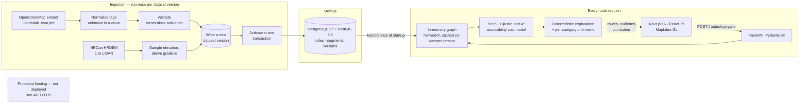

# PathAble AI

**Pedestrian routing that compares the shortest walk against one you can actually make — and shows its working.**

Pick two points in Waterloo, Ontario and a mobility profile. PathAble returns the ordinary shortest walking route
alongside a route that respects that profile, and explains the difference using what OpenStreetMap actually
records: steps, surfaces, gradients, kerbs. Where nothing has been recorded, it says so.

[](https://github.com/s2002kumar/pathable-ai/actions/workflows/ci.yml)
[](https://github.com/s2002kumar/pathable-ai/actions/workflows/security.yml)

## Recorded demo · 67 seconds

[](docs/evidence/media/pathable-demo.webm)

**▶ [Watch the 67-second recording](docs/evidence/media/pathable-demo.webm)** — a real browser driving the real
production containers against the real Waterloo network. No response is faked or spliced; the
[full-stack test suite](apps/web/tests/fullstack/recruiter-demo.spec.ts) watches the network and asserts that the
figures on screen are the ones the API returned.

**This is a local production-build demo. PathAble is not deployed anywhere** — there is no live URL, no hosting
account and no public service. Everything above runs from `docker compose` on one laptop.

## What the comparison actually says

One press loads `campus-library-to-student-life` from the committed twenty-journey corpus and the engine answers
live:

|                        | Distance    | Stairways |
| ---------------------- | ----------- | --------- |
| Shortest walking route | **287.4 m** | 4         |
| Wheelchair route       | **354.1 m** | 0         |

**+66.67 m (23%) to avoid four stairways.** Every statement beside those numbers is tagged with the kind of claim
it is — _recorded in OpenStreetMap_, _your profile's rules_, _derived from an elevation model_, _not recorded_ —
because an observation, an estimate, a policy consequence and an absence are four different things, and the fourth
must never read as the first. On this journey OpenStreetMap records **no accessibility detail for 100% of the
route**, and the interface says so above the distances rather than below them.

There is **no machine learning here**. Every routing decision is a deterministic rule over recorded map
attributes; every response carries `ml_predictions_used: false`, typed as a literal so a client cannot compile
against anything else.

## Verified engineering facts

Every figure below links to the evidence that produced it and the conditions it was measured under. Nothing here
is estimated.

| Fact                                                                                                                                                                                         | Evidence                                                                                                                                                                           |
| -------------------------------------------------------------------------------------------------------------------------------------------------------------------------------------------- | ---------------------------------------------------------------------------------------------------------------------------------------------------------------------------------- |
| **155,714 nodes · 180,554 physical segments · 361,108 directed edges** ingested from a published OpenStreetMap extract, with 1 m LiDAR elevation                                             | [evidence index](docs/evidence/README.md) · [`production-envelope.json`](docs/evidence/production-envelope.json)                                                                   |
| **Graph load: 46.83 s → 22.14 s median, peak Python heap 1,381.3 MB → 700.7 MB (−49%)** after replacing ORM entity construction with narrow Core columns                                     | [`waterloo-graph-load.json`](docs/evidence/waterloo-graph-load.json) vs [`-before.json`](docs/evidence/waterloo-graph-load-before.json) · [KI-6](docs/development/KNOWN_ISSUES.md) |
| **Routes unchanged by that optimisation** — identical node and segment SHA-256 fingerprints, identical answers on all 20 corpus journeys                                                     | [`waterloo-routes.json`](docs/evidence/waterloo-routes.json)                                                                                                                       |
| **18 of 20 corpus journeys route differently** for a wheelchair profile; 1 has no route at all and says why                                                                                  | [`waterloo-routes.json`](docs/evidence/waterloo-routes.json)                                                                                                                       |
| **A\* is not faster here**: 1,970 expanded nodes against Dijkstra's 7,409, but 195 ms against 213 ms at p50 — reported as a wash, not a win                                                  | [`waterloo-performance.json`](docs/evidence/waterloo-performance.json)                                                                                                             |
| **Production container envelope**: one API worker holds 997 MB steady / 1,064 MB peak and is routable 18.7 s after start; the frontend fits 512 MiB with 92% headroom over three cold starts | [`production-envelope.json`](docs/evidence/production-envelope.json) · [ADR 0009](docs/adr/0009-deployment-architecture.md)                                                        |
| **Dataset bootstrap needs no PostgreSQL superuser** — verified against a role with `superuser=f`, after the obvious `pg_restore --disable-triggers` was shown to fail on one                 | [`restore-dataset.sh`](infra/production-smoke/restore-dataset.sh) · [KI-8](docs/development/KNOWN_ISSUES.md)                                                                       |

### Tests, by suite

Counted separately on purpose — these suites overlap in what they cover, and adding them up would be a bigger
number describing less.

| Suite                                   | Count                                                           | Command                                                    |
| --------------------------------------- | --------------------------------------------------------------- | ---------------------------------------------------------- |
| Backend, unit + PostGIS integration     | **727 passed, 1 skipped**, 89.09% coverage against an 86% floor | `uv run pytest --cov=src/pathable_api --cov-fail-under=86` |
| Frontend unit (Vitest)                  | **220 passed**, 92.83% statements                               | `pnpm --filter @pathable/web test:unit`                    |
| Browser, stubbed API (Playwright + axe) | **80 passed**                                                   | `pnpm --filter @pathable/web test:e2e`                     |
| Browser, full stack, nothing stubbed    | **16 passed**                                                   | `pnpm --filter @pathable/web test:e2e:fullstack`           |

The backend integration tests run against real PostgreSQL/PostGIS, never a mock. The full-stack suite drives a
real browser through real containers. Nine of its sixteen tests need the real Waterloo network and
[skip with a printed reason](docs/evidence/DEMO_SCRIPT.md) where it is absent, which includes CI.

## How it fits together



Solid boxes are implemented and measured. The dashed box is a costed proposal in
[ADR 0009](docs/adr/0009-deployment-architecture.md) and nothing has been bought or provisioned.

The backend's Pydantic models are the single source of truth for the HTTP contract: they generate
`openapi.json`, which generates the frontend's TypeScript types, and CI fails if the committed output drifts. A
dataset is immutable once activated — ingestion writes a _new_ version and swaps activation in one transaction —
which is why a cached graph can never go stale.

## Where to go next

| If you want to…                        | Read                                                                                                     |
| -------------------------------------- | -------------------------------------------------------------------------------------------------------- |
| Run it yourself                        | [Local setup](docs/development/LOCAL_SETUP.md) · [production smoke](docs/deployment/PRODUCTION_SMOKE.md) |
| See the numbers and how they were made | [Evidence index](docs/evidence/README.md)                                                                |
| Understand the engineering decisions   | [Architecture](docs/architecture/OVERVIEW.md) · [ADRs](docs/adr/)                                        |
| Interrogate the claims                 | [Project defence](docs/PROJECT_DEFENSE.md) · [claims ledger](docs/CLAIMS_LEDGER.md)                      |
| Know what is deliberately missing      | [Known issues](docs/development/KNOWN_ISSUES.md) · [phases](docs/product/PHASES.md)                      |
| Give the demo                          | [Demo script](docs/evidence/DEMO_SCRIPT.md)                                                              |

## Status, licence and attribution

**Gate A and Gate B are passed** — a real regional network with elevation, and accessibility-aware routing that
defensibly beats a shortest path. Gate C (machine learning) and Gate D (production credibility) are not, and
nothing in this repository claims otherwise. See [phases](docs/product/PHASES.md).

**Source code: © Sandeep Kumar. All rights reserved.** This repository is _source-visible_ — readable by anyone
who opens it — which is not a grant of any right to use, copy, modify or redistribute the code. It is **not open
source**. See [`LICENSING.md`](LICENSING.md).

**The data is licensed separately and more generously, and its obligations are unaffected by the above.** Map data
© [OpenStreetMap](https://www.openstreetmap.org/copyright) contributors, [ODbL 1.0](https://opendatacommons.org/licenses/odbl/);
the pedestrian graph derived from it is a derived database under ODbL. Basemap tiles in the screenshots and
recording: [OpenFreeMap](https://openfreemap.org) © [OpenMapTiles](https://www.openmaptiles.org/) Data from
[OpenStreetMap](https://www.openstreetmap.org/copyright). Gradients derived from NRCan's High Resolution Digital
Elevation Model: _Contains information licensed under the
[Open Government Licence – Canada](https://open.canada.ca/en/open-government-licence-canada)._ The measurement
files in [`docs/evidence/`](docs/evidence/README.md) are OSM-derived data. Full detail in
[`docs/licensing/DATA_SOURCES.md`](docs/licensing/DATA_SOURCES.md).

---

# Engineering documentation

Everything below is the working documentation for people running or extending the project.

## Screenshots

Screenshots are generated by the Playwright suite rather than committed, so they
can never drift from the code:

```bash
pnpm --filter @pathable/web test:e2e
# -> apps/web/artifacts/screenshots/
#      desktop-chromium-route-comparison.png   both routes, drawn and described
#      desktop-chromium-application.png
#      desktop-chromium-map-loading.png
#      desktop-chromium-map-failure.png
#      mobile-chromium-*.png
```

CI uploads the same files as the `playwright-report` artifact.

Those run against stubbed responses, which is what makes them deterministic. A
separate suite captures the product answering from the **real, active Waterloo
dataset** — no stubs, a 180,554-segment network, and a live API. It needs a
database and is not part of CI:

```bash
pnpm --filter @pathable/web exec playwright test --config playwright.screenshots.config.ts
# -> docs/evidence/screenshots/
```

Those images, and the measurements behind them, are in
[`docs/evidence/`](docs/evidence/README.md).

---

## Architecture

```
┌─────────────────────────┐         ┌──────────────────────────┐
│  apps/web               │  HTTP   │  services/api            │
│  Next.js 16 · React 19  │────────▶│  FastAPI · Pydantic v2   │
│  MapLibre GL            │         │  SQLAlchemy 2 · psycopg 3│
└───────────┬─────────────┘         └────────────┬─────────────┘
            │                                     │
            │ generated types                     │ SQL
            │                                     ▼
┌───────────▼─────────────┐         ┌──────────────────────────┐
│  packages/contracts     │◀────────│  PostgreSQL 17 + PostGIS │
│  openapi.json           │ OpenAPI │  Alembic migrations      │
│  src/generated/api.ts   │         └──────────────────────────┘
└─────────────────────────┘
```

The backend's Pydantic models are the single source of truth for the HTTP
contract. They generate `openapi.json`, which generates the frontend's
TypeScript types. CI fails if the committed output drifts.

A network dataset is immutable once activated: ingestion writes a _new_ version,
validates it, and swaps activation in one transaction. Routing loads the active
dataset into memory once and caches it by dataset version id — which is why a
cached graph can never go stale.

More detail: [architecture overview](docs/architecture/OVERVIEW.md) ·
[data flow](docs/architecture/DATA_FLOW.md) ·
[future ML architecture](docs/architecture/FUTURE_ML_ARCHITECTURE.md) ·
[decision records](docs/adr/)

---

## Prerequisites

| Tool           | Version | Notes                                   |
| -------------- | ------- | --------------------------------------- |
| Node.js        | ≥ 20.11 | 22 or 24 recommended                    |
| pnpm           | ≥ 10    | `corepack enable` installs it           |
| Python         | 3.13    | uv installs it for you if missing       |
| uv             | ≥ 0.12  | Python package manager                  |
| Docker Desktop | ≥ 4.30  | Only needed for the containerised stack |

Docker is optional for frontend and backend unit work. It is required for the
database, and therefore for the integration tests.

### Windows setup

```powershell
# 1. Package managers
corepack enable
powershell -c "irm https://astral.sh/uv/install.ps1 | iex"

# 2. Clone and enter the repository
git clone <repository-url> pathable-ai
cd pathable-ai

# 3. Environment
Copy-Item .env.example .env

# 4. Install everything (pnpm workspace + Python venv + Chromium)
pnpm bootstrap
```

`uv` installs to `%USERPROFILE%\.local\bin`. If `uv` is not found afterwards,
open a new terminal so the updated `PATH` is picked up. The repository's scripts
resolve `uv` from that location directly, so `pnpm` commands work either way.

### macOS and Linux setup

```bash
corepack enable
curl -LsSf https://astral.sh/uv/install.sh | sh

git clone <repository-url> pathable-ai
cd pathable-ai
cp .env.example .env
pnpm bootstrap
```

---

## Running it

### With Docker (full stack)

```bash
cp .env.example .env          # PowerShell: Copy-Item .env.example .env
docker compose up --build
```

| Service | URL                                       |
| ------- | ----------------------------------------- |
| Web     | http://localhost:3000                     |
| API     | http://localhost:8000                     |
| Docs    | http://localhost:8000/docs                |
| Health  | http://localhost:8000/api/v1/health/ready |
| DB      | `localhost:5433` (not 5432 — see below)   |

The API waits for the database, applies migrations, then starts. The web
container waits for the API to report healthy.

> **Why port 5433?** A locally installed PostgreSQL usually already owns 5432,
> and the resulting bind failure is not obvious. Change `DB_PORT` in `.env` if
> 5433 is also taken.

### Natively (no Docker for the app)

Start only the database in Docker, then run both services on the host:

```bash
docker compose up -d db
pnpm dev
```

`pnpm dev` runs the API on http://127.0.0.1:8000 and the web app on
http://127.0.0.1:3000, with prefixed output and a single Ctrl+C to stop both.

---

## Loading a network

Routing needs a network to route on. The `pathable` CLI lives in
`services/api`; run it with `uv run` from there, or from the repository root
with `node scripts/uv.mjs run pathable ...`.

```bash
cd services/api

# Create the pilot regions the API knows about.
uv run pathable regions seed

# Import the real Waterloo pedestrian network from a published extract. This is
# the path used for the live dataset: no rate limits, no dependency on a donated
# service, and re-readable as often as you like. Download an extract first, e.g.
# https://download.geofabrik.de/north-america/canada/ontario-latest.osm.pbf
uv run pathable ingest pbf --region waterloo --file .osm-data/ontario-latest.osm.pbf   --provider geofabrik --source-timestamp 2026-08-16T23:08:23+00:00

# Or import over Overpass. Convenient, but it is a donated service with strict
# rate limits and a city-wide unsimplified query is impractically slow.
uv run pathable ingest osm --region waterloo

# Sample elevation and derive a grade for every segment long enough to have one.
# NRCan HRDEM is 1 m LiDAR under the Open Government Licence - Canada; the 898 GB
# mosaic is read in place by byte range, never downloaded.
uv run pathable elevation apply --region waterloo --provider hrdem

# Or load the deterministic test fixture instead — a nine-node network built
# around one stairway-versus-ramp comparison. Useful for development and for
# demonstrating the product without touching a public service.
# It is NOT Waterloo accessibility data and is loaded under its own region.
uv run pathable ingest synthetic

# What is live right now.
uv run pathable datasets list
```

Ingestion never edits the live network. It writes a new dataset version,
validates it, and swaps activation in one transaction — so a failed import
cannot degrade what people are currently routing on, and rolling back is
re-activating the previous version.

Overpass is a donated public service with strict rate limits. PathAble checks
that an endpoint is reachable before it starts, so an unreachable one fails in
seconds with an explanation rather than hanging. Pass `--overpass-url` to use a
different instance.

### Reporting what the data actually contains

```bash
# What OpenStreetMap records for the region, category by category. There is
# deliberately no combined "accessibility score": a region with excellent kerb
# data and no surface data would average to "moderate", which describes nothing.
uv run pathable coverage --region waterloo --json coverage.json

# Route a fixed corpus of twenty real journeys under two profiles and report
# every outcome — including the ones where nothing changed and the ones with no
# route at all.
uv run pathable evaluate --region waterloo --profile wheelchair --algorithms --ablate
```

Results from the live dataset are kept in
[`docs/evidence/`](docs/evidence/README.md).

### Running the production images

```bash
docker compose -f infra/production-smoke/compose.yaml up --build -d
```

An isolated stack — its own project name, database volume and ports — that
runs the real API and web images with `ENVIRONMENT=production` and loads the
pilot region's graph at startup. [`docs/deployment/PRODUCTION_SMOKE.md`](docs/deployment/PRODUCTION_SMOKE.md)
walks through migrating an empty database, populating the Waterloo dataset,
and measuring what the containers need; the numbers and the hosting decision
they led to are in [ADR 0009](docs/adr/0009-deployment-architecture.md).

### Measuring routing performance

```bash
uv run pathable benchmark route --region waterloo --samples 50
uv run pathable benchmark route --grid 100 --samples 30   # synthetic lattice
```

Every figure it prints is a wall-clock measurement from that run on that
machine. The `--grid` mode measures an in-memory lattice, which is _not a map of
anywhere_ — it exists to characterise how routing scales with network size, and
any number from it must be reported as such.

```bash
# The cold-start cost: load the active dataset into the routing graph, three
# timed runs plus one under tracemalloc, and write the full report as JSON.
uv run pathable benchmark load --region waterloo --json graph-load.json
```

`benchmark load` records the dataset, the commit, the machine and how much
memory was free before every run, and it marks a run **invalid** rather than
averaging it in when the wall-clock says the process was mostly not running
(a suspended laptop, or paging). Timing runs and the tracemalloc run are kept
apart because the tracer slows allocation. The report also carries a SHA-256
fingerprint of every node and segment, so two versions of the loader can be
shown to have built the same graph — a speed-up that quietly dropped a field
would otherwise still look like a speed-up.

---

## Commands

Run from the repository root.

| Command                   | What it does                                                                                                   |
| ------------------------- | -------------------------------------------------------------------------------------------------------------- |
| `pnpm bootstrap`          | Install everything: pnpm workspace, Python venv, Chromium                                                      |
| `pnpm dev`                | Run API and web together                                                                                       |
| `pnpm format`             | Prettier + Ruff format, writing changes                                                                        |
| `pnpm format:check`       | Verify formatting without writing                                                                              |
| `pnpm lint`               | ESLint + Ruff                                                                                                  |
| `pnpm typecheck`          | `tsc --noEmit` + mypy strict                                                                                   |
| `pnpm test`               | Unit tests, frontend and backend. No database required                                                         |
| `pnpm test:unit`          | Same as `pnpm test`                                                                                            |
| `pnpm test:integration`   | Backend tests against real PostGIS. **Requires the database**                                                  |
| `pnpm test:e2e`           | Playwright + axe. No backend or internet required                                                              |
| `pnpm test:e2e:fullstack` | Browser → Next.js → FastAPI → PostGIS, **no stubs**. Needs a database                                          |
| `pnpm contracts:generate` | Regenerate `openapi.json` and the TypeScript contracts                                                         |
| `pnpm contracts:check`    | Fail if the committed contracts are stale                                                                      |
| `pnpm build`              | Next.js production build                                                                                       |
| `pnpm check`              | Fast gate: everything that needs no database or browser                                                        |
| `pnpm check:full`         | Everything, including real PostGIS and browser tests. **Fails** rather than skipping if the database is absent |
| `pnpm map:evidence`       | Manual: screenshot the map against the real tile provider. Not part of CI                                      |

> **The real basemap is verified by hand, not by CI.** Automated suites use a
> source-less offline map style so a green build never depends on a third-party
> tile server — which also means they cannot detect a broken basemap. See
> [manual real-basemap verification](docs/development/TESTING.md#manual-real-basemap-verification)
> and [KI-1](docs/development/KNOWN_ISSUES.md).
> | `pnpm docker:up` | `docker compose up --build -d` |
> | `pnpm docker:down` | Stop the stack, **keeping** the database volume |
> | `pnpm docker:logs` | Follow logs from all services |
> | `pnpm docker:reset-db` | **Destroy** local database data, with confirmation |

> `install` is `pnpm install` plus `uv sync` in `services/api`; `pnpm bootstrap`
> runs both. It is not exposed as `pnpm install` because `install` is a reserved
> npm lifecycle script name and defining it would make `pnpm install` recurse.

Backend-only equivalents run from `services/api`: `uv run ruff check .`,
`uv run mypy src tests`, `uv run pytest`, `uv run alembic upgrade head`,
`uv run python -m pathable_api`.

> Start the API through `python -m pathable_api`, not the bare `uvicorn` CLI.
> On Windows uvicorn selects an event loop that psycopg cannot use, and every
> database connection fails while liveness still returns 200. The entry point
> sets an explicit selector loop factory; see
> [`services/api/src/pathable_api/core/event_loop.py`](services/api/src/pathable_api/core/event_loop.py).

---

## Environment variables

Copy `.env.example` to `.env`. `.env` is git-ignored and must never be committed.

### Backend

| Variable                    | Default       | Notes                                                    |
| --------------------------- | ------------- | -------------------------------------------------------- |
| `ENVIRONMENT`               | `development` | `development` \| `test` \| `production`                  |
| `API_HOST`                  | `127.0.0.1`   | `0.0.0.0` inside a container                             |
| `API_PORT`                  | `8000`        | 1–65535                                                  |
| `DATABASE_URL`              | —             | `postgresql://` is normalised to `postgresql+psycopg://` |
| `ALLOWED_ORIGINS`           | —             | Comma-separated exact origins, no trailing slashes       |
| `LOG_LEVEL`                 | `INFO`        | `DEBUG` … `CRITICAL`                                     |
| `LOG_FORMAT`                | `json`        | `json` \| `console`                                      |
| `READINESS_TIMEOUT_SECONDS` | `2.0`         | Bound on the database probe, 0 < value ≤ 30              |

In `production` the service refuses to start unless `DATABASE_URL` is set,
`ALLOWED_ORIGINS` names at least one explicit origin, no origin is `*`, and
`LOG_FORMAT` is `json`. Every problem is reported at once.

### Frontend

> **Every `NEXT_PUBLIC_*` value is compiled into the JavaScript bundle and is
> readable by anyone who visits the site.** Never put a credential, API key or
> private hostname behind that prefix. CI fails the build if a `NEXT_PUBLIC_`
> variable is named like a secret.

| Variable                        | Default                                        |
| ------------------------------- | ---------------------------------------------- |
| `NEXT_PUBLIC_API_BASE_URL`      | `http://localhost:8000`                        |
| `NEXT_PUBLIC_MAP_STYLE_URL`     | `https://tiles.openfreemap.org/styles/liberty` |
| `NEXT_PUBLIC_PILOT_CENTER_LAT`  | `43.4668`                                      |
| `NEXT_PUBLIC_PILOT_CENTER_LON`  | `-80.5164`                                     |
| `NEXT_PUBLIC_PILOT_ZOOM`        | `14`                                           |
| `NEXT_PUBLIC_PILOT_REGION_NAME` | `Waterloo, Ontario`                            |

An out-of-range coordinate, an invalid zoom or a malformed URL renders a
configuration error page naming every offending variable, rather than a blank
screen. Because Next inlines these at build time, changing them requires a
rebuild.

---

## Repository structure

```
pathable-ai/
├── apps/web/                 Next.js App Router frontend
│   ├── src/app/              routes, layout, /api/healthz
│   ├── src/components/       header, pilot panel, configuration error
│   ├── src/features/map/     MapLibre lifecycle, WebGL detection, states
│   ├── src/features/system-status/  backend status probe and badge
│   ├── src/lib/              public config validation, helpers
│   ├── src/styles/           design tokens, global CSS
│   └── tests/e2e/            Playwright + axe
├── services/api/             FastAPI backend
│   ├── src/pathable_api/     api/, core/, db/, schemas/, main.py
│   ├── migrations/           Alembic; 0001 establishes PostGIS
│   └── tests/                unit/ and integration/
├── packages/contracts/       generated OpenAPI + TypeScript types
├── infra/docker/             container entrypoints
├── docs/                     product, architecture, ADRs, licensing, security
├── scripts/                  cross-platform dev commands
└── compose.yaml              web + api + db
```

---

## Testing

| Suite                | Command                   | Needs                                     |
| -------------------- | ------------------------- | ----------------------------------------- |
| Backend unit         | `pnpm test:unit`          | nothing                                   |
| Backend integration  | `pnpm test:integration`   | PostGIS (`docker compose up -d db`)       |
| Frontend unit        | `pnpm test:unit`          | nothing                                   |
| End-to-end + axe     | `pnpm test:e2e`           | Chromium; **no** backend, **no** internet |
| Full stack, no stubs | `pnpm test:e2e:fullstack` | Chromium + real API + real PostGIS        |

Coverage floors are enforced: 85% on backend authored code, 80% on frontend
authored code. Full detail, including what the accessibility tests do and do not
prove, is in [`docs/development/TESTING.md`](docs/development/TESTING.md).

---

## Troubleshooting

**`docker compose up` fails with "port is already allocated".**
Something already owns 3000, 5433 or 8000. Change `WEB_PORT`, `DB_PORT` or
`API_PORT` in `.env`. On Windows, `netstat -ano | findstr :5433` names the
process.

**Docker Desktop will not start / "The system cannot find the file specified"
on `//./pipe/dockerDesktopLinuxEngine`.**
The `com.docker.service` helper is not running. Start Docker Desktop from the
Start menu and approve the elevation prompt; the service cannot be started from
a non-elevated shell. Confirm with `docker info`.

**`uv: command not found` after installing it.**
Open a new terminal. The repository's own scripts resolve `uv` from
`~/.local/bin` regardless, so `pnpm` commands keep working.

**Readiness reports `not_ready` with `postgis extension is not installed`.**
The database is up but un-migrated. Run
`uv --directory services/api run alembic upgrade head`, or restart the API
container, whose entrypoint migrates on start.

**The map shows "This browser cannot display the map".**
MapLibre needs WebGL 2. Check `chrome://gpu`; hardware acceleration is often
disabled on managed machines. The written pilot description remains available.

**`pnpm contracts:check` fails.**
The backend schemas changed without regenerating. Run
`pnpm contracts:generate` and commit the result.

**Integration tests skip with "DATABASE_URL is not set".**
Start the database and export the URL:
`docker compose up -d db`, then use the value from `.env`.

---

## Current limitations

- No machine learning of any kind: every routing decision is a deterministic
  rule over recorded OpenStreetMap attributes.
- No imagery, no user reports, and no per-element edit times — evidence
  freshness is a dataset-level fact.
- No user accounts and no authentication.
- The default map style (OpenFreeMap) is a development convenience and **has not
  been approved for production**. See
  [`docs/licensing/DATA_SOURCES.md`](docs/licensing/DATA_SOURCES.md).
- No deployment target exists; everything runs locally.
- The baseline migration creates the PostGIS extension and nothing else.

---

## Attribution

Map data © [OpenStreetMap](https://www.openstreetmap.org/copyright) contributors,
licensed under the [Open Database License](https://opendatacommons.org/licenses/odbl/).
Development tiles are served by [OpenFreeMap](https://openfreemap.org/).

Gradients derived from elevation use NRCan's High Resolution Digital Elevation
Model (CanElevation): _Contains information licensed under the
[Open Government Licence – Canada](https://open.canada.ca/en/open-government-licence-canada)._
The same statement is returned with every route response that carries a derived
gradient and shown in the route panel.
OpenStreetMap data and OpenStreetMap-operated services are separate
considerations — see the licensing document before relying on either.

---

## Contributing and security

[`CONTRIBUTING.md`](CONTRIBUTING.md) · [`SECURITY.md`](SECURITY.md) ·
[threat model](docs/security/THREAT_MODEL.md)

## Licence

**Source code: © Sandeep Kumar. All rights reserved.** This repository is
intended to be _source-visible_ — readable by anyone who opens it — which is not
a grant of any right to use, copy, modify or redistribute the code. **PathAble is
not open source** and should not be described as MIT, Apache-licensed, or free to
use. See [`LICENSING.md`](LICENSING.md) for the full policy and for why the
permissive door was deliberately left open rather than walked through.

**The data is licensed separately, and more generously.** OpenStreetMap data and
the pedestrian graph derived from it are ODbL 1.0; elevation-derived gradients
carry the Open Government Licence – Canada statement; the measurement files in
[`docs/evidence/`](docs/evidence/README.md) are OSM-derived data attributed in
that directory. Those obligations are unaffected by the code's copyright, and
dependency licences are recorded in
[`docs/licensing/DATA_SOURCES.md`](docs/licensing/DATA_SOURCES.md).
