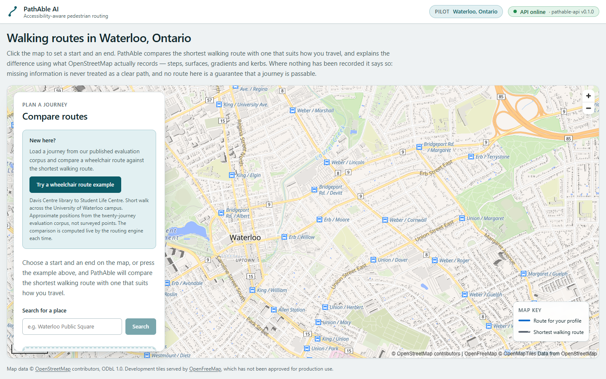
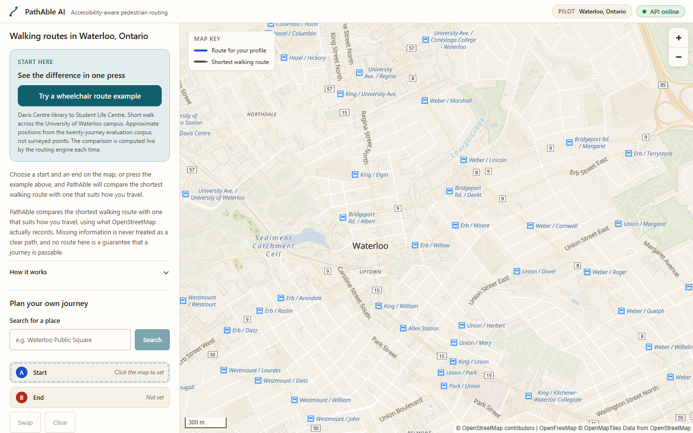
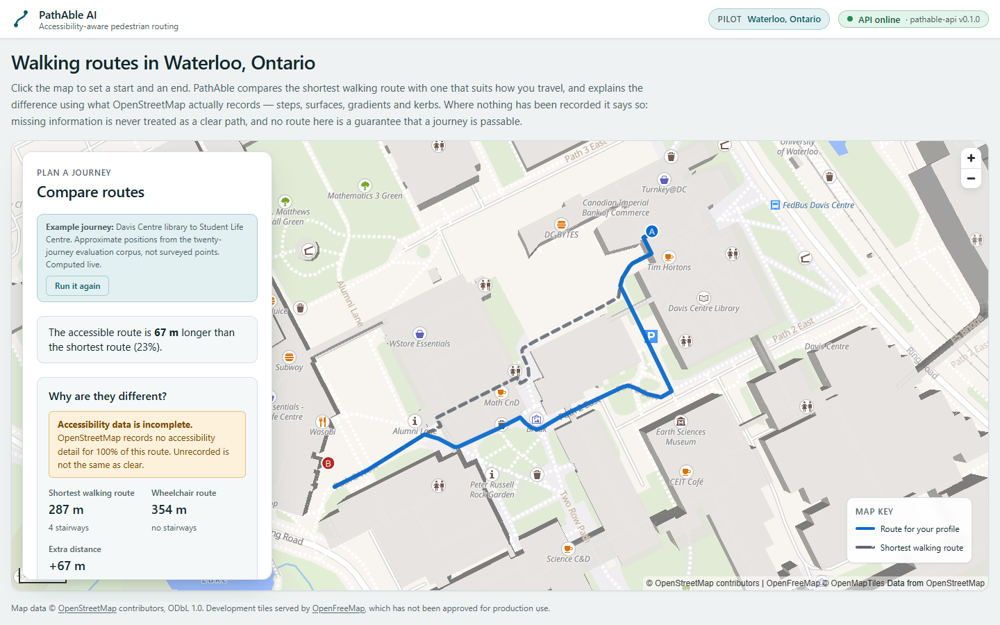
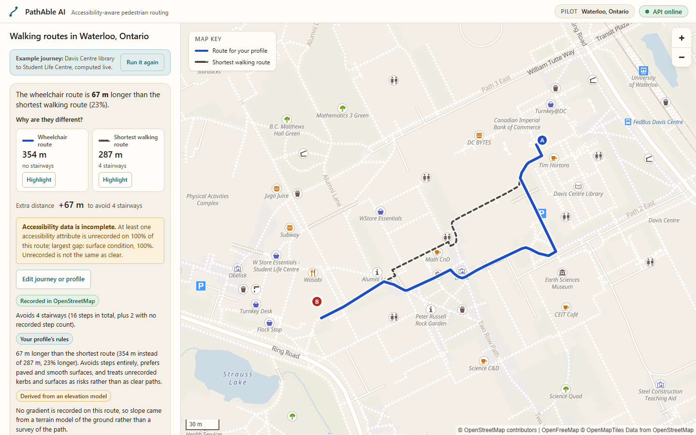
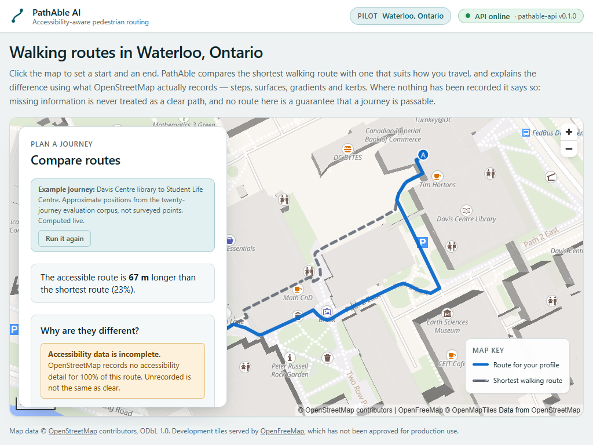
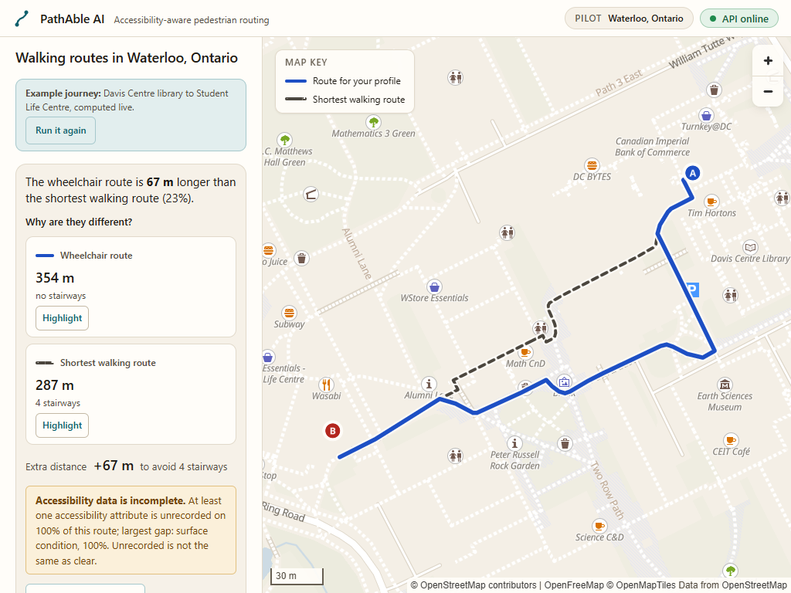
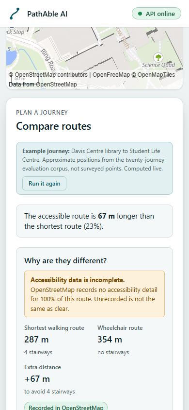
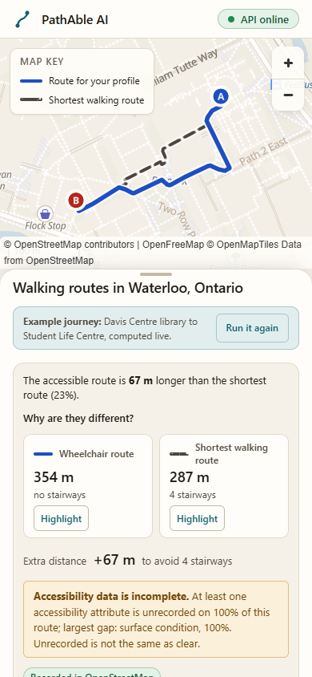
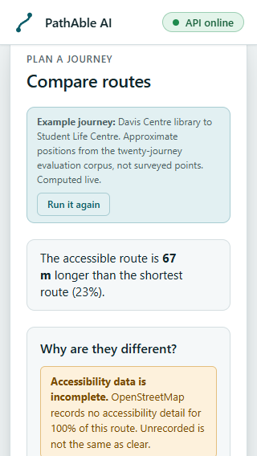
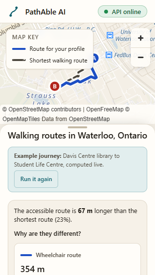

# Frontend polish (PA-UX-01): a map-first candidate

What changed in the interface, why, what it was measured against, and what it
is not. Everything visual here was checked in a real browser at the sizes named
below; every number came from a run on this laptop and is a local figure, not
a field measurement.

**Baseline:** `main` at `29a77491431fc9c6574b7fc84b9bf4db664c3b1b`
(`v0.3.0-public-release`), production web image built from that commit.
**Candidate:** branch `feat/premium-map-experience`. The routing engine, the API
contract and the dataset (`51e75f78…`) are unchanged; nothing below touches a
route's numbers.

> **Superseded in part.** The two sections below record the PA-UX-01/01F
> candidate as it was reviewed. The founder rejected that composition; the
> palette and the layout it describes were replaced by
> [the map-first revision](#the-map-first-revision-pa-ux-02a) further down. The
> correctness work in "Review corrections (PA-UX-01F)" is unchanged and still
> current. Nothing here is rewritten, because it is the record of what was
> actually built and measured at the time.

## The direction: quiet, precise cartography

The page is a navigation instrument. Warm ivory surfaces, ink-coloured text, one
restrained teal for controls, and the two route lines are the only saturated
marks on the screen. Every panel change is a 150–200 ms decelerating transition;
the map camera is capped at 600 ms; both collapse to nothing under
`prefers-reduced-motion`. Typography is the platform UI face — already
installed, already hinted, zero bytes — with tabular digits on every figure so
"287 m" and "354 m" sit in the same column. No font was added.

### What moved, and why

| Before                                                                                           | After                                                                                                                                                       | Why                                                                                                                                                                                        |
| ------------------------------------------------------------------------------------------------ | ----------------------------------------------------------------------------------------------------------------------------------------------------------- | ------------------------------------------------------------------------------------------------------------------------------------------------------------------------------------------ |
| A four-line introduction above the map on every viewport                                         | One line of title; two sentences of purpose and a "How it works" disclosure, placed after the answer                                                        | The two sentences that matter — missing data is not a clear path, no route is a guarantee — stay visible. The rest is there for whoever opens it, and the answer reaches the first screen. |
| Desktop: a floating card over the map's left third                                               | A stable 340–400 px planner column beside the map; the map takes the rest and nothing floats over it                                                        | A fitted route was tucked under the card (visible in the baseline capture). Now the fit uses the whole map area.                                                                           |
| Mobile: map at 52 dvh, then the planner                                                          | Map at 36 dvh (never under 13 rem), then a sheet in normal document flow                                                                                    | The sheet looks like one and behaves like a page: nothing to drag, no competing scroll region, and the figures plus the uncertainty line fit on the first screen at 390 × 844.             |
| Liberty basemap as served: saturated parks, yellow primaries, extruded 3D buildings at high zoom | The same style, toned at runtime by layer ID: ivory ground, muted greens and water, softer casings, extrusions off. Labels, icons and attribution untouched | The style stays on OpenFreeMap's CDN (it is theirs, not ours to copy). At campus zoom the extrusions hid paths behind them and cost the software renderer dearly.                          |
| Two plain lines, 5–6 px                                                                          | Each line cased in the surface colour, a pale halo under each endpoint marker, marker labels in a font the style actually serves                            | Legible over any road. The default label font requested a glyph range OpenFreeMap does not host; every route logged a 404.                                                                 |
| Figures in a definition list                                                                     | Two figure cards with a "Highlight on map" control each, then the extra distance, then the uncertainty line, in one block with the headline                 | The map and the numbers read as one result. Highlighting dims the other line to 28%; it never removes it, and the note beside it says neither route is certified.                          |
| "No accessibility detail for 100% of this route"                                                 | "At least one accessibility attribute is unrecorded on 100% of this route; the largest single gap is surface condition, unrecorded for 100%"                | See below. The old sentence contradicted the four recorded stairways on the same screen.                                                                                                   |
| Route detail and provenance always expanded                                                      | "What is on this route" and "Where this comes from" as labelled `<details>`                                                                                 | Nothing removed; the no-model statement and OSM/elevation attribution stay in the page, the rest is a click away.                                                                          |
| `pathable-api v0.1.0` on the status badge                                                        | Kept in the badge for assistive tech and as a tooltip; visually hidden                                                                                      | A build version is a diagnostic, not part of a route's hierarchy.                                                                                                                          |

### What the "100%" means

`unknown_data_fraction` is computed in `routing/engine.py` as the share of the
route's **length** over segments whose `unknown_attributes` tuple is non-empty.
That tuple (`geo/features.py`) lists, per segment: `surface` if unclassified,
`smoothness` if unclassified, `incline` if neither an OSM incline nor a derived
grade exists, `kerb` if the segment is a crossing with no kerb record, and
`steps` if the steps state is unknown. So the figure is "at least one of these
is missing here", weighted by length — **not** "nothing is known here". On the
verified campus journey every segment lacks at least one of them (surface
condition and width are missing on 100%), while the four stairways are fully
recorded. The interface now says exactly that, and names the largest single gap
from `evidence_coverage`, which is reported per category for this reason.

The backend caution `missing_accessibility_data` said the same thing in the
older words — "no accessibility details for most of this route" — and is
shown verbatim under "Before you rely on this". Its text was corrected in the
review round below; its code, threshold, evidence fields and the route it
describes are unchanged.

## Review corrections (PA-UX-01F)

A review of the candidate found three claims the data did not support and one
control that was hard to reach. Each is fixed on the same branch; the visual
direction is unchanged.

**"The two routes follow the same path" was inferred from distance.** The
note appeared whenever the two distances differed by under 15 m. Equal length
does not establish equal geometry — a detour can measure the same as the
direct path — so the note now comes from identity the response already
carries, and from nothing else. The rule (`route-identity.ts`) is
conservative: when both routes carry segments, their ordered `edge_identity`
lists must be equal; when neither does, their ordered coordinate sequences
must be equal and nonempty; anything else — one side without segments, empty
geometry, any mismatch — makes no claim. Distance is never consulted, and no
geospatial dependency or endpoint was added.

**"The same length" was a 15 m threshold, before this PR as well.** The
headline now states the difference the response reports, in the profile's
name: "The wheelchair route is 10 m longer than the shortest walking route
(3%)". It says "the same length" only when the two figures display as the same
number — a difference under 0.5 m, the display precision of the metre figures
— and then it says "to the nearest metre". A missing difference is reported as
not reported, never as equality. The engine's own `same_distance` explanation
("essentially the same length") is no longer repeated in the evidence list;
the headline carries the number.

**The backend caution said "no accessibility details".** The API's
`missing_accessibility_data` caution is the route's `unknown_data_fraction` in
words, and the fraction counts segments missing at least one attribute. The
text at its source (`routing/comparison.py`) now reads "On most of the
wheelchair route (100% of its length) at least one accessibility attribute —
surface, surface condition, gradient, steps or kerb — has no record in
OpenStreetMap. Missing data is not evidence that a path is clear." It names the
route it describes (the accessible route when there is one, else the standard
route — the same referent as before) and keeps its length denominator. Code,
threshold, evidence fields, schema and routing are untouched, so the contract
drift check and every benchmark JSON are unaffected; the older wording in
`waterloo-routes.json` is what those runs produced at the time and is kept as
such. Fixtures on the frontend carry the new sentence; the assertions they
protect ("not evidence that a path is clear" stays on screen) are unchanged.

**"Every accessibility category this route touches is recorded" claimed too
much.** With no gaps in `evidence_coverage`, the line now says "No gaps
reported in the assessed categories (surface, surface condition, gradient,
path width, and kerbs at crossings)", that this is a statement about the
record and not a certification, and that a gradient may still come from an
elevation model. When the response carries no coverage at all, the line says
the gaps are unknown. Where kerb is the largest gap, the sentence says "of
crossings", because that is its denominator.

**Getting back to the controls.** The answer sits above the planning
controls, so changing the profile or the endpoints meant scrolling to find
them. "Edit journey or profile", at the foot of the answer, scrolls the
planning section into view and moves focus to it; the next Tab lands on the
search box. It sends no request and resets nothing — the comparison and the
routes on the map stay as they were — and the scroll is instant under reduced
motion. Measured in the browser suite: no `compare` request, no map lifecycle
transition, the same result still rendered.

The "after" captures and `frontend-polish-candidate.json` were refreshed from
the review head, so they show the corrected wording and the edit control; the
"before" captures are unchanged. The performance study was not repeated: the
changes are text, one button and a pure function over data the page already
had, and the refreshed capture's timings sit inside the earlier ranges.

Two things found on the way. The `\b` word boundaries in two "never say
safe/verified" assertions had become literal backspace characters, so those
regexes could match nothing and the assertions could not fail; they are
restored. And the verified journey still returns 287.4 m with four stairways
against 354.1 m with none from the rebuilt API — read from the response, not
the screen.

## The map-first revision (PA-UX-02A)

The founder rejected the composition above. The objection was not a detail: on
an ordinary laptop window the product read as a **document with a map inset**,
not as a map. This section records what was diagnosed, what changed, and what
was measured. Everything before it is kept as the history it is.

### What was actually wrong

**These viewports are stand-ins.** The founder's own browser was not available
to this work, and a screenshot does not record its window size, its zoom level
or its root font size — so nothing here can claim to be _their_ viewport. What
it can do is measure the breakpoint. 1000 × 700 and 1366 × 768 CSS pixels are
ordinary laptop windows chosen to sit either side of the gate that failed, and
390 × 844 is a common phone. Every figure below names the size it was taken at.

Reproduced in a browser at 1000 × 700 CSS pixels, which is an ordinary laptop
window: `RouteWorkspace.module.css` gated its two-pane desktop layout at
`min-width: 64rem` — 1024 px at a 16 px root. A 1000 px window missed it by
24 px and fell all the way back to the phone layout: a **34dvh map strip** above
a long scrolling page. The measured map area at that size was `1000 × 287`,
under a third of the viewport.

The screenshots the founder was looking at could not settle this on their own —
a capture does not record a browser's zoom level — so the layout was measured
directly instead: at 1000 × 700, `matchMedia('(min-width: 64rem)')` reported
`false`. Changing the founder's zoom would not have been a fix. The breakpoint
was in the wrong place, and the composition behind it was the wrong shape.

The warm ivory palette (`--color-canvas: #f3eee5`) reinforced the impression:
paper, with a map on it.

### What changed

| Before                                                                  | After                                                                                                               | Why                                                                                                                                                                                     |
| ----------------------------------------------------------------------- | ------------------------------------------------------------------------------------------------------------------- | --------------------------------------------------------------------------------------------------------------------------------------------------------------------------------------- |
| Desktop two-pane grid gated at `min-width: 64rem`                       | Three layouts gated on **height**: side panel (≥ 48rem wide), bottom sheet (narrower), document flow (< 34rem tall) | What makes a floating panel wrong is a window too short to hold one and still show map — 200% zoom, landscape phones. Width was the wrong question.                                     |
| Map is a block in the page; on desktop, a column beside it              | Map fills the workspace at every size above the flow fallback; everything else floats over it                       | The map is the product. At 1000 × 700 the map area went from `1000 × 287` to `1000 × 652`.                                                                                              |
| A full-height planner rail                                              | A floating panel, 20–24 rem wide, with its own scroll                                                               | The rail owned a third of the screen whether or not it had anything in it.                                                                                                              |
| Warm ivory surfaces (`#f3eee5` / `#fffdf9`)                             | Crisp neutral (`#eceef0` / `#ffffff`), same restrained teal accent                                                  | A control panel over live cartography, not a page. The rejected composition was not rebuilt as translucent cards.                                                                       |
| Five permanently expanded profile cards, each with its own rule summary | A row of chips, and one rule line for the chosen profile                                                            | Four of those summaries describe a journey the viewer is not taking. All five profiles stay offered, and it is still a `radiogroup` — arrow keys and the single Tab stop are unchanged. |
| Two route figures **and** two route cards repeating the same distances  | Figures only, now carrying walking time and step count                                                              | The cards were the longest block in the panel and said nothing new. No figure was lost. They remain for the single-route cases, where there is nothing to compare against.              |
| A "Start here / See the difference in one press" welcome card           | A compact action; the corpus's "approximate positions, not surveyed points" caveat behind a labelled disclosure     | The caveat moved behind a control, not out of the product.                                                                                                                              |
| Purpose and "How it works" above the planning controls                  | Below them; the two safety sentences stay visible in every state                                                    | A viewer who has pressed the example is reading a result, not a preface. The purpose line is still the map's `aria-describedby` target.                                                 |
| Example card, then the answer, then the controls                        | Once there is an answer it takes the top of the panel; the example becomes "Run it again" beneath it                | This is what makes the figures, the detour and the uncertainty line fit together inside a phone sheet. Until there is an answer, the example is still first.                            |
| `FIT_PADDING` assumed nothing covered the map                           | `paddingForPanel()` measures the panel and frames the route in the **unobscured** area                              | The panel moved; it did not stop existing. A route centred underneath it is the failure the previous layout was built to avoid.                                                         |
| A drag handle that did not drag                                         | A labelled Collapse / Expand control on the sheet                                                                   | A control that looks operable and is not is a lie about the interface.                                                                                                                  |
| MapLibre's scale and ODbL credit anchored to the viewport corners       | Both inset by `--map-inset-left` / `--map-inset-bottom`, published from the measured panel                          | A full-bleed map with a panel across its bottom would have covered the credit — quietly, and in exactly the screenshot somebody would publish.                                          |

### The bug the phone found

The first implementation chose the panel's anchored edge as the one it reached
into **least**. For a bottom sheet on a 390 × 844 phone that is its _width_
(366 px), not its _height_ (517 px), so the camera was told to inset the left
edge by almost the whole map, and framed the route off-screen entirely — the
capture showed a stormwater pond a kilometre from the journey. The edge is now
chosen by which inset leaves the most map behind, and `route-layers.test.ts`
carries the case that failed.

### Cartography

The basemap is still OpenFreeMap's "Liberty", still toned at runtime by layer ID
rather than copied into this repository. Two changes: the ground and its fills
move from ivory to neutral, and **pedestrian paths are drawn up rather than
down**. Liberty renders footways as a thin white dash, which disappears against
a white road on a pale ground; on a pedestrian router that hides the network the
product exists to route over. They now carry their own cool grey tint and a
wider stroke on the style's own exponential ramp, and `highway-name-path` is
darkened enough to read.

This changes how paths are **drawn**, never which ones exist. No path is added,
removed or reclassified, and a drawn path is still not a claim that it is in
PathAble's routing graph. `basemap-tone.test.ts` asserts that no override sets a
visibility or an opacity, that no width ramp reaches zero, and that the
pedestrian ramp is never thinner than Liberty's own.

### Measured, at this revision

Captured by
[`tests/screenshots/ux-02a-states.spec.ts`](../../apps/web/tests/screenshots/ux-02a-states.spec.ts),
which stubs nothing, against the **production web image** built from this
branch and running in the isolated envelope stack — web `3001`, API `8001`,
database `5434`, dataset `pathable-envelope-db-data` at `0005_kerb_tiers`,
155,714 nodes and 180,554 segments. Browser: Playwright Chromium with
SwiftShader, device pixel ratio 1, root font size 16 px.

The raw run, including the matched media queries and every box below, is
[`screenshots/ux-02a/observations.json`](screenshots/ux-02a/observations.json).
The images are beside it.

| Viewport   | Map area   | Planner            | `min-width: 64rem` | Whole answer in viewport | Horizontal overflow | Console errors |
| ---------- | ---------- | ------------------ | ------------------ | ------------------------ | ------------------- | -------------- |
| 1000 × 700 | 1000 × 652 | 320 × 628, at left | **false**          | yes                      | none                | none           |
| 1366 × 768 | 1366 × 720 | 369 × 696, at left | true               | yes                      | none                | none           |
| 390 × 844  | 390 × 796  | 366 × 523, a sheet | false              | yes                      | none                | none           |

"Whole answer" is both route figures, the extra-distance line and the
uncertainty line, each entirely inside the viewport, with nothing opened and
nothing scrolled.

The 1000 × 700 row is the point of the revision: `min-width: 64rem` is still
`false` at that size — the media query has not moved — and the map is
full-bleed anyway, because the layout no longer depends on it. Under the
previous composition that same row measured a `1000 × 287` map.

The ODbL credit is clear of the planner at all three sizes. On the phone it is
measured at `y` 280–320 with the sheet starting at `y` 321, which is the
`--map-inset-bottom` wiring doing its job rather than a coincidence — and the
one pixel of clearance is deliberate: the inset is rounded **up**, because a
panel edge lands on a fractional pixel routinely and rounding to nearest left
the credit 0.07 px underneath the sheet.

### The answer behind those captures

The example is **one press**, and what appears is the live engine's. Fetched
directly from the envelope API on the same dataset, for the campus journey:

- shortest route **287.4 m**, **4 stairways** (16 recorded steps, plus 2
  stairways with no recorded step count)
- wheelchair route **354.1 m**, **0 stairways**
- detour **+66.7 m** (23%), `unknown_data_fraction` **1.0**, `gradient_source`
  `derived_elevation`, kerb coverage **0.0**, `ml_predictions_used` **false**

Those are the figures the browser tests assert against. They are properties of
this dataset and this journey, never rendering constants.

The recording
[`media/pathable-ux02a-interaction.webm`](media/pathable-ux02a-interaction.webm)
(2.6 MB, 1000 × 700, no audio, captured from the same preview and the same
image) runs the example, brings the shortest route forward and lets it go,
opens and closes "What is on this route", and then changes the profile to
crutches or cane. That last step is answered live and gives a different real
result — **327 m, +40 m (14%), 7 minutes, no stairways** against the same
287 m shortest route. Nothing in it is stubbed, scripted or re-timed.

### Verified, at this revision

On this laptop, at this branch's head, observed rather than inferred.

| Gate                                                    | Result                                                                               |
| ------------------------------------------------------- | ------------------------------------------------------------------------------------ |
| Prettier, ESLint, `tsc --noEmit`                        | clean                                                                                |
| Frontend unit (Vitest, coverage)                        | 276 passed, 18 files; statements 93.5%, branches 86.2% (floor 80%)                   |
| Stubbed browser suite (desktop + Pixel 7, axe included) | 112 passed, 0 failed, 0 skipped (56 per project, desktop and Pixel 7)                |
| Full-stack against the envelope stack, real Waterloo    | 16 passed, 0 skipped (9 recruiter-demo + 7 stack)                                    |
| Contract drift                                          | generated contracts match the backend schemas                                        |
| Production web image                                    | rebuilt from this branch; every capture and the recording above came from that image |
| CI on this head (`6e78656`)                             | 16 of 16 checks pass, both workflows green — observed on the pull request            |

Checked by hand in the captures and the recording rather than by a machine:
the map full-bleed behind the panel at every size above the flow fallback; the
route framed in the part of the map the panel does not cover; the ODbL credit
and the map key clear of the panel; the profile chips reachable by arrow key
as one Tab stop; a visible focus ring on every control; reduced motion
collapsing the panel transitions and the camera move (measured at 1e-05 s);
the dark scheme rendering a dark panel over the same light cartography, which
is deliberate — the map key has to match what is drawn on the map, not the
surface around it.

Two things a machine would not have caught, both found by looking:

- Under SwiftShader the basemap needs several seconds after `fitBounds` before
  a capture is meaningful. Screenshots taken too early came back with the route
  and most labels missing, which is indistinguishable from a product that
  failed to draw its answer. The committed capture spec waits for network idle
  and then eight seconds, and says why.
- One browser-suite failure in an earlier run — the status badge reading
  "unreachable" against a 15 s expectation — was contention from screenshot
  captures running alongside the suite, not a regression.
  `system-status.spec.ts` passes 10/10 on its own.

CI's full-stack job reports **7 passed, 9 skipped**. That is the known
synthetic-fixture gap (KI-9), unchanged by this work: the runner loads the
synthetic dataset, so the nine recruiter-demo tests that need the real Waterloo
network skip there. All sixteen ran locally against the real dataset, which is
where the 287.4 m / 354.1 m figures above come from. No new skip was
introduced.

Automated axe passing is a floor, not a claim of accessibility compliance, and
nobody who uses a mobility aid has reviewed this interface.

### Still outstanding

The visual direction has **not** been accepted. This revision is a candidate for
one review; PA-UX-02B does not begin until it is accepted or redirected.

## States

Initial · selecting (start set, end awaited: the row is outlined and the status
line says what the next click sets) · preparing (badge reads "Preparing routes";
a request during that window fails with the API's message and a retry) ·
loading · success · same path (only when the response's segments establish it:
a note says the two lines overlap and the dashed one sits underneath) · no
route (the API's reason,
the standard route still drawn) · API error (message plus "Try again", points
kept) · search empty / disabled · map unavailable (overlay, planner still
usable). The stubbed browser suite exercises each of these against fixed
responses.

## Measurements

Same production build mode (the `runtime` Docker target), same dataset, same
laptop, same harness. Browser: Playwright Chromium with SwiftShader, so the map
is rasterised on the CPU and every number is slower than a real GPU would be.
Network: the API and web containers on loopback; basemap tiles from
`tiles.openfreemap.org` over the internet; a fresh browser context per run, so
tiles were fetched, not cached, on every run.

### Captures

Before is the `v0.3.0-public-release` web image; after is this branch's image,
both running in the isolated production-smoke stack against the same API and
dataset, screenshotted by the same script after the network went idle. Files
are in [`screenshots/polish/`](screenshots/polish/); the raw per-viewport
results, including the in-viewport checks, are
[`frontend-polish-baseline.json`](frontend-polish-baseline.json) and
[`frontend-polish-candidate.json`](frontend-polish-candidate.json).

| Viewport               | Before                                                                             | After                                                                            |
| ---------------------- | ---------------------------------------------------------------------------------- | -------------------------------------------------------------------------------- |
| 1440 × 900, landing    |        |        |
| 1440 × 900, comparison |  |  |
| 1024 × 768, comparison |    |    |
| 390 × 844, comparison  |     |     |
| 320 × 568, comparison  |    |    |

What is on the first screen after one press, without scrolling or opening a
disclosure — both figures, the extra distance and the uncertainty line, each
measured as a whole element inside the viewport:

| Viewport   | Before                | After                      |
| ---------- | --------------------- | -------------------------- |
| 1440 × 900 | all four              | all four                   |
| 1024 × 768 | uncertainty line only | all four                   |
| 390 × 844  | none                  | all four                   |
| 320 × 568  | none                  | none (reachable by scroll) |
| 844 × 390  | none                  | none (reachable by scroll) |

Console: the baseline logged one 404 per page load (a glyph range the
basemap does not serve, requested by the marker-label layer). The candidate
logs nothing.

A recording of the main interaction — load, press, the comparison arriving,
highlight one route, open a disclosure, change profile — is
[`media/pathable-polish-interaction.webm`](media/pathable-polish-interaction.webm)
(1280 × 800, 17.7 s, Playwright's recorder, unedited).

### Interaction timings

Two warm interactions, measured from the browser: **press** is from the click
on the example to the comparison block being visible; **deep link** is from
navigation to `/?example=…` to the comparison block being in the document.
Fresh browser context every run.

The first pass ran one image and then the other, and its numbers disagreed
with each other from run to run by more than the difference between the
images — desktop press ranged 229–3001 ms on the candidate and 322–1549 ms on
the baseline in six runs. That is the software renderer and a laptop, not the
page. So the figure reported here is an **interleaved A/B**: eight rounds,
each round serving the baseline image and then the candidate image on the same
port, same stack, one run apiece:

| Metric              | Baseline median (min–max) | Candidate median (min–max) | Change |
| ------------------- | ------------------------: | -------------------------: | -----: |
| Press, 1440 × 900   |          460 ms (336–999) |           390 ms (341–621) |   −15% |
| Press, 390 × 844    |          296 ms (237–406) |           212 ms (154–454) |   −29% |
| Deep link, 1440×900 |          590 ms (407–793) |           547 ms (527–615) |    −7% |
| Deep link, 390×844  |          318 ms (294–581) |           288 ms (261–529) |    −9% |

The card's review trigger — a repeatable warm regression over 20% — fired on
the sequential passes (desktop press +41% in one six-run pass; phone deep link
+46% in one ten-run pass) and did not survive interleaving, where every metric
is equal or slightly better and the ranges overlap. The honest reading is
**equivalent performance with better presentation**; the negative deltas are
within this machine's noise and are not claimed as an improvement.

Actions to the comparison: one press, before and after.

### Bundle

First-load JavaScript, compressed as served (`content-encoding: gzip`), eleven
script responses on the deep-link load:

| Before        | After         | Change       |
| ------------- | ------------- | ------------ |
| 548,686 bytes | 550,666 bytes | +1,980 bytes |

No dependency was added. The largest responses are unchanged: the MapLibre
chunk (262 KB) and its worker's shared module (139 KB).

### Main-thread trace of the press

A Chromium trace (`devtools.timeline`) of the press on 1440 × 900, one run
each, summarised as main-thread task time: baseline 1,733 ms of tasks with
279 ms scripting and six tasks over 50 ms (longest 555 ms); candidate 1,637 ms
with 237 ms scripting and six over 50 ms (longest 595 ms). The long tasks are
MapLibre rasterising tiles on the CPU, not React. One run each; a shape, not
a measurement to quote.

### Cold start of the web container

`docker run` of each image to a 200 from `/api/healthz` and from `/`, three
times each, host clock:

| Image     | healthz (s)      | page (s)         |
| --------- | ---------------- | ---------------- |
| Baseline  | 2.69, 1.68, 2.24 | 2.80, 1.91, 2.33 |
| Candidate | 3.01, 1.60, 1.75 | 3.26, 1.78, 2.07 |

The API container was not rebuilt and its cold start is not re-measured here;
the previously recorded figure (18.7 s to routable, one worker) stands as its
own evidence and is not restated as current.

### Reproducing

The PA-UX-01 harness was a one-off outside the repository, like the demo
capture script before it. **PA-UX-02A's is committed**, so its figures can be
re-run rather than taken on trust:

```bash
# The envelope stack, per PRODUCTION_SMOKE.md, serving this branch on 3001.
docker compose -f infra/production-smoke/compose.yaml build web
docker compose -f infra/production-smoke/compose.yaml up -d --no-deps web

PLAYWRIGHT_CHROMIUM_ARGS="--host-resolver-rules=MAP localhost 127.0.0.1" SCREENSHOT_BASE_URL=http://localhost:3001   pnpm --filter @pathable/web exec playwright test   --config=playwright.screenshots.config.ts ux-02a-states
```

The other commands are the repository's own: the stubbed browser suite
(`pnpm --filter @pathable/web test:e2e`) and the full-stack suite against the
Compose stack. Chromium on this laptop needs the resolver flag above because
the container publishes on `127.0.0.1` only while `localhost` resolves to
`::1` first; see the smoke guide.

## Verification

> These are the **PA-UX-01/01F** figures, at that revision's final commit. The
> map-first revision has its own, in
> [Verified, at this revision](#verified-at-this-revision) above.

All on this branch at that commit, on this laptop, observed rather than
inferred.

| Gate                                                    | Result                                                                       |
| ------------------------------------------------------- | ---------------------------------------------------------------------------- |
| `tsc --noEmit`, ESLint, Prettier                        | clean                                                                        |
| Frontend unit (Vitest, coverage)                        | 249 passed, 17 files; statements 93.9%, branches 87.2% (floor 80%)           |
| Stubbed browser suite (desktop + Pixel 7, axe included) | 100 passed (80 existing + 20 in `layout.spec.ts`)                            |
| Full-stack against the Compose stack, real Waterloo     | 16 passed, 0 skipped (9 recruiter-demo + 7 stack)                            |
| Contract drift                                          | generated contracts match the backend schemas                                |
| Production build / Docker web image                     | built; the candidate image is what every "after" figure above was taken from |
| CI on the final SHA                                     | see the pull request checks (recorded in the PR, not here)                   |

Checked by hand in the captures and the recording, not by a machine:
keyboard reach to the example and to both highlight controls; visible focus on
every control; the map key naming a highlighted route in words; attribution
uncovered at every size; reduced motion collapsing panel transitions and the
camera move; no horizontal overflow at 320 px; the two-pane layout giving way
to document flow at 720 × 450 (the size 200% zoom leaves a 1440 × 900 window).
Automated axe passing is a floor, not a claim of accessibility compliance.

## Limitations

- Local figures on one machine under a software renderer. Not Core Web Vitals,
  not production latency.
- The design was checked by the author in a browser. No user with a mobility
  aid, and nobody outside the repository, has reviewed it.
- The basemap is still OpenFreeMap's development service, toned at runtime.
  Nothing here changes its licence position or approves it for production.
- The full-stack real-data suite runs locally against the production-smoke
  stack; CI still loads the synthetic fixture and skips those tests (KI-9).
